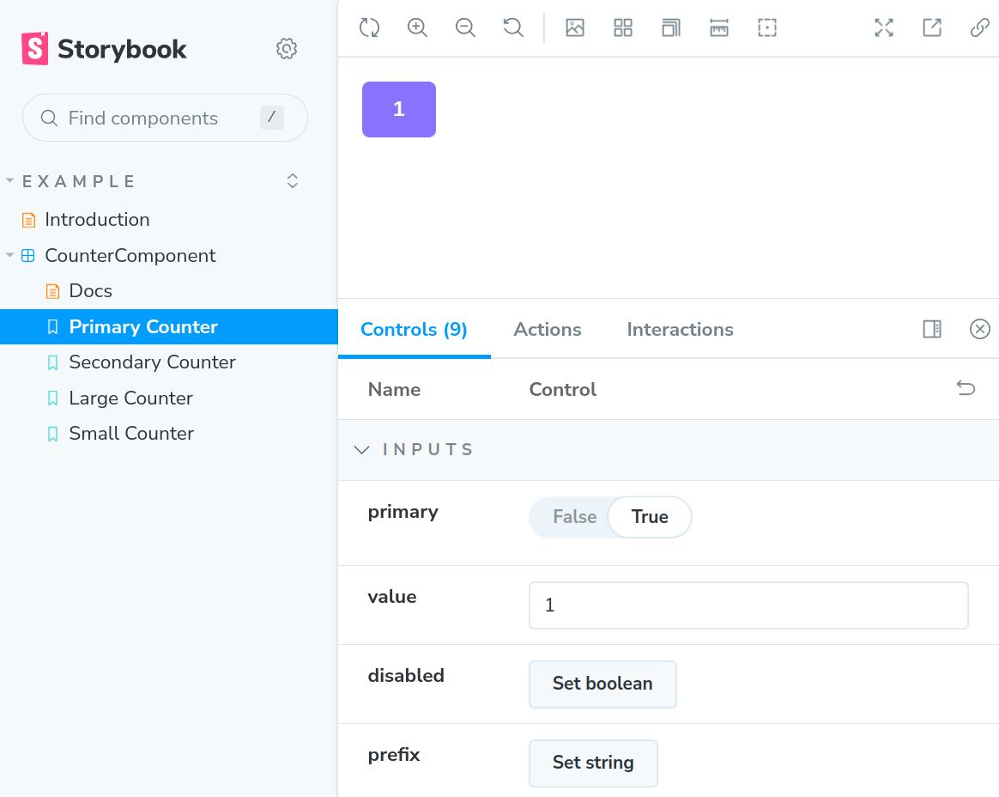

# Week 02. Angular Task (Slurm Навыкум "Build Containers!")

## Задача

Есть проект на Angular (исходники хранятся в этом каталоге), который представляет собой библиотеку компонентов одной из [дизайн-систем](https://tilda.education/courses/web-design/designsystem/)

Необходимо упаковать витрину-компонентов в Docker-образ, используя в качестве базы конечного образа [Nginx](https://hub.docker.com/_/nginx) версии 1.22 (не alpine и не perl)

Для промежуточных этапов (сборка, тестирование, линтинг) необходимо использовать [Node 18-buster-slim](https://hub.docker.com/_/node)

**Важно**: нужно упаковывать не сам проект, а [витрину-компонентов на базе Storybook](https://storybook.js.org) 

### Формулировка разработчика

Разработчик сказал следующее* (дословно):
> Мы делаем библиотеку компонентов на Angular, которая должна использоваться всеми проектами внутри компании
>
> Чтобы остальные понимали, как ею пользоваться, мы подготовили [Storybook](https://storybook.js.org)
>
> Теперь нам нужно упаковать всё в Docker так, чтобы при запуске Docker-контейнера люди могли увидеть Storybook
>
> Чтобы запустить Storybook локально, нужно выполнить команду `npm run storybook`, чтобы собрать его: `npm run build-storybook`
>
> Вот так примерно выглядит Storybook:
>
> 
>
> **Важно**:
> 1. У нас есть авто-тесты, с UI они запускаются просто командой `npm test` (`Ctrl + C` для остановки)
> 2. Мы придерживаемся определённого CodeStyle, поэтому проверяем стиль кода через `npm run lint`

*Лирическое отступление*: к сожалению, часто бывает, что разработчики знают, как использовать свои инструменты в режиме разработки, но не знают, как использовать "за пределами разработки", например, как опубликовать тот самый Storybook, поэтому с этим придётся разбираться самостоятельно

Примечание*: мы обещали, что файлов будет немного (до 10 значащих), поэтому явно указываем, куда смотреть:
1. [`package.json`](package.json)
2. [`.gitignore`](.gitignore)

В других файлах ничего смотреть не нужно, кроме того, не нужно вообще что-то в файлах проекта менять (кроме добавления собственного `Dockerfile` и `.dockerignore`)

Что нужно сделать:
> 1. Упаковать витрину в Docker-образ, при этом распарралелить:
> - сборку витрины
> - проверку стиля кода
> - запуск авто-тестов
> 2. Выложить всё в виде публичного образа на GHCR (GitHub Container Registry), чтобы мы могли сами затестить и переиспользовать

**Важно**: мы хотим запускать и авто-тесты, и проверку стиля кода (и мы хотим делать это именно **параллельно**)

Чего не нужно делать (дословно):
> Никаких `entrypoint.sh` и других sh-скриптов писать не нужно
> 
> Переделывать приложение и конфигурационные файлы вроде `package.json` тоже не нужно, настраивайте запуск всего через:
>
> 1. Установку необходимых переменных окружения
>
> 2. Передачу флагов в соответствующие команды, например, в `npm test`
>

### Требования

1. Всё должно быть оформлено в виде публичного репозитория на GitHub
2. Вся сборка образов должна проходить через GitHub Actions
3. Образ должен выкладываться в GitHub Container Registry (GHCR)

К текущему заданию дополнительно предъявляются требования:
1. [Docker Buildx Build](https://docs.docker.com/build/) (указывайте явно при сборке `docker buildx build`)
2. Multi-Stage

Подсказка: никакие конфигурации Karma и т.д. создавать не нужно (достаточно установки пары переменных окружения и передачи нескольких параметров)
